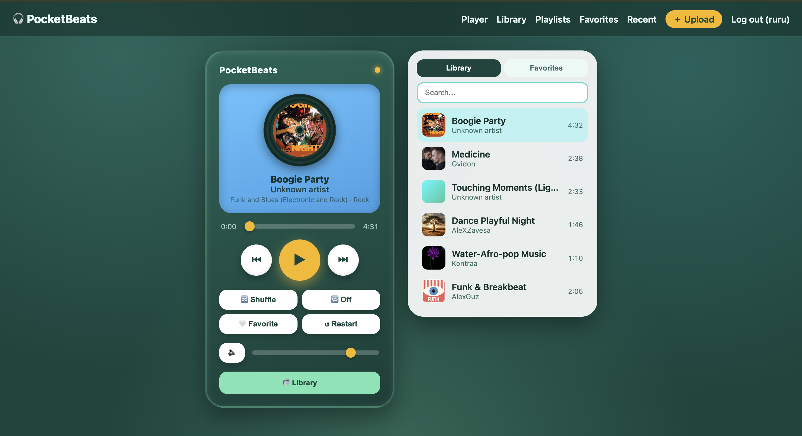

# 🎧 PocketBeats

## 📌 Overview

PocketBeats is a web-based MP3 player built with Django and Python. Users can
upload music they own, organize songs into playlists, and play them through a
colorful interface inspired by classic handheld MP3 players.

The project combines a nostalgic music-player design with modern web features
such as accounts, favorites, search, listening history, and responsive controls.


## ✨ Main Features

- Play, pause, restart, skip, and return to the previous song
- Seek through a song with an interactive progress bar
- Change the volume or mute the player
- Shuffle songs and repeat one song or an entire playlist
- Upload MP3 files and add song information
- Upload album artwork
- Search by song title, artist, album, or genre
- Create, rename, and delete personal playlists
- Save favorite songs
- View recently played music
- Create an account and keep a personal music library
- Use the player on desktop, tablet, or mobile screens

## Demo Walkthrough

<video src="static/images/demo.mp4" controls width="700"></video>

<<<<<<< HEAD

[](images/pocketbeats-demo.mp4)
=======
[](images/pocketbeats-demo.mp4)
>>>>>>> 1946b38 (Add PocketBeats MP4 demo)

## 🛠️ Tech Stack

* Python & Django
* Pydantic                     
* HTML & CSS                 
* JavaScript & HTML5 Audio     
* Django Templates           
* SQLite, then PostgreSQL
* Local media      

## 🧠 How It Works

* A user creates an account or signs in.
* The user uploads an MP3 file and optional album cover.
* Django securely stores the file and saves its song information.
* Pydantic checks imported or API-provided metadata before it enters the application.
* The user selects a song from the library or a playlist.
* JavaScript loads the file into the HTML5 audio player.
* The interface updates the title, artwork, progress, and playback buttons.
* Django records favorites, playlists, and recent listening activity.


## 🚀 Run locally

Requires **Python 3.11+**.

```bash
cd pocketbeats

# Create and activate a virtual environment
python3 -m venv .venv
source .venv/bin/activate     
pip install -r requirements.txt
cp .env.example .env  

python manage.py migrate

# (Optional) create an admin account
python manage.py createsuperuser
python manage.py runserver
```
Then open <http://127.0.0.1:8000/>.

### Running tests

```bash
python manage.py test
```

## Playing Real Music

PocketBeats uses the browser’s built-in audio player, with JavaScript powering the custom music controls. Users should only upload music they own or have permission to use. Version 1 will support user uploads only and will not include copyrighted commercial music.

## Downloaded Music from Free Sites.

* https://pixabay.com/music/ 
* https://incompetech.com/
* https://soundscrate.com/ 

## 🔒 Upload Safety

* Users must sign in to upload music.
* Only safe audio files and file sizes are allowed.
* Each file gets a secure, unique name.
* Uploaded music stays private.
* Secret keys are stored in a `.env` file.
* Users must confirm they have permission to use the music.
* Production uploads may also be scanned for malware.

## 📄 License

This project is available for educational and personal use.
